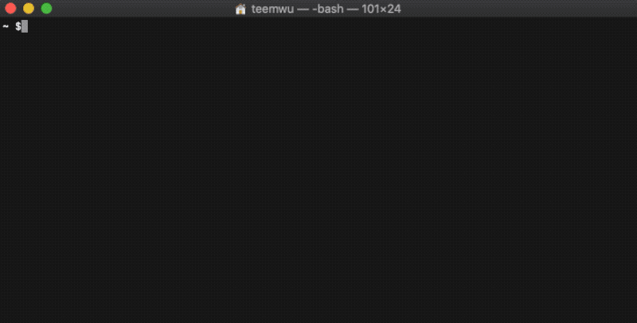

# command_line_translate
A translation tool running on the command line.

## 说明
一个简单的小工具，以命令行的形式在终端进行查词翻译。

## 安装
前提已经安装了 node
```bash
npm i command_line_translate -g
```

## 使用
直接在终端输入 “ clt + 你要翻译的单词 ”即可

## 例子


## Q&A
1、Windows 系统下，npm 运行时报错“因为在此系统上禁止运行脚本” ？

管理员权限运行 “powershell”，执行 “ set-ExecutionPolicy RemoteSigned ” 语句，选择 “ Y ” 即可
